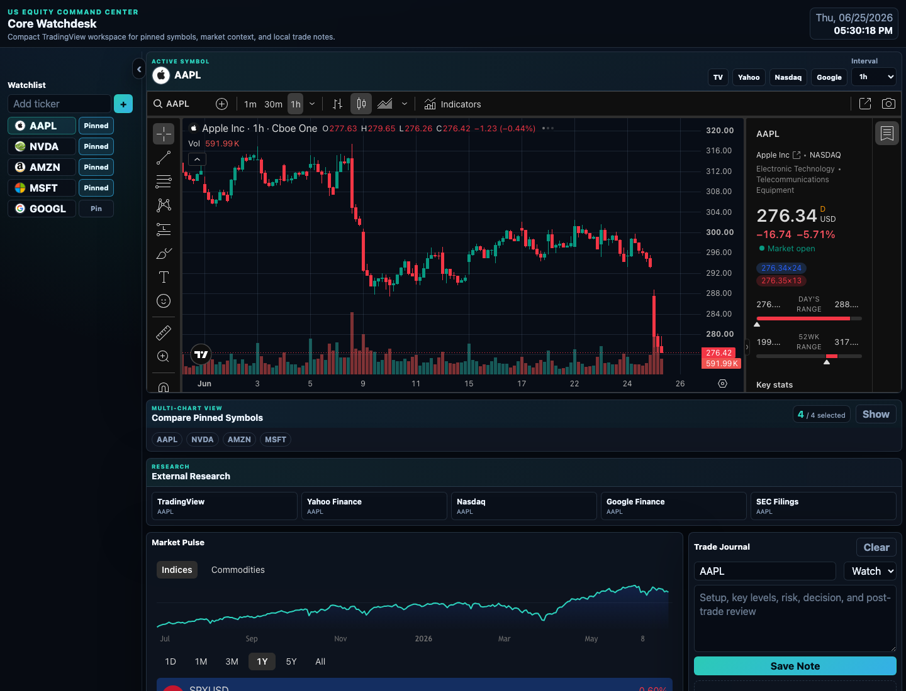

# Stock Watchdesk

A compact, local dashboard to **add stocks and compare multiple TradingView charts side by side** — plus market context, per-symbol research links, and a private trade journal. No API keys, no build step, no backend database. Everything you add stays in your own browser.



## Run

Requires [Node.js](https://nodejs.org) 18+ (no dependencies to install).

```bash
git clone https://github.com/yuannh/stock-watchdesk.git
cd stock-watchdesk
npm start          # or: node server.js
```

Then open:

```text
http://127.0.0.1:8010/index.html
```

The server binds to `127.0.0.1` only and serves a fixed allowlist of static files with `Cache-Control: no-store`, so charts always reflect live TradingView data.

## Features

- **Watchlist** — add or remove tickers; click to focus a symbol.
- **Multi-chart compare** — pin up to 4 symbols and view their charts side by side.
- **Main chart** — full TradingView Advanced Chart for the active symbol, with selectable interval (1m–1W).
- **Market Pulse** — TradingView market overview for indices and commodities.
- **Research links** — one-click TradingView / Yahoo / Nasdaq / Google Finance / SEC for the active symbol.
- **Trade journal** — quick notes per symbol, stored locally in your browser via `localStorage`.

## How it works

- Charts and market data come directly from [TradingView](https://www.tradingview.com) embedded widgets — there is no server-side data fetching and no caching layer.
- Your watchlist, pinned symbols, interval, and journal are persisted in `localStorage`. They never leave your machine.
- Default symbols reset only when `WATCHLIST_VERSION` in [`app.js`](app.js) is bumped, so updates can refresh defaults without wiping what you've added.

## Add your own symbols

Type a ticker in the watchlist box (e.g. `TSLA`) and press **+**. To use a specific exchange, use the `EXCHANGE:TICKER` form (e.g. `NYSE:BRK.B`). Your additions are saved automatically.

## License

[MIT](LICENSE)
